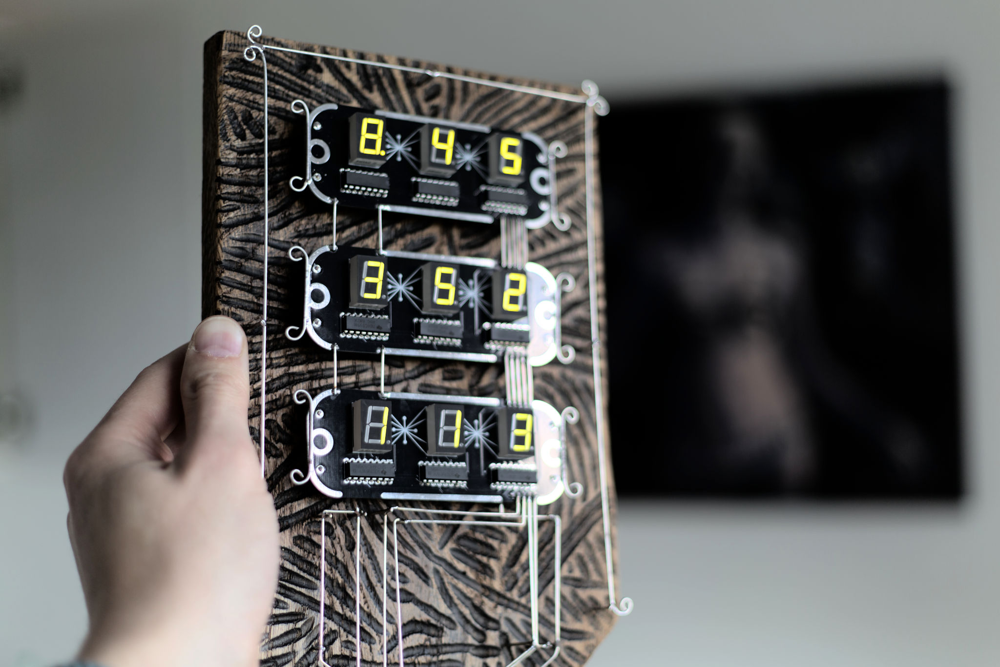
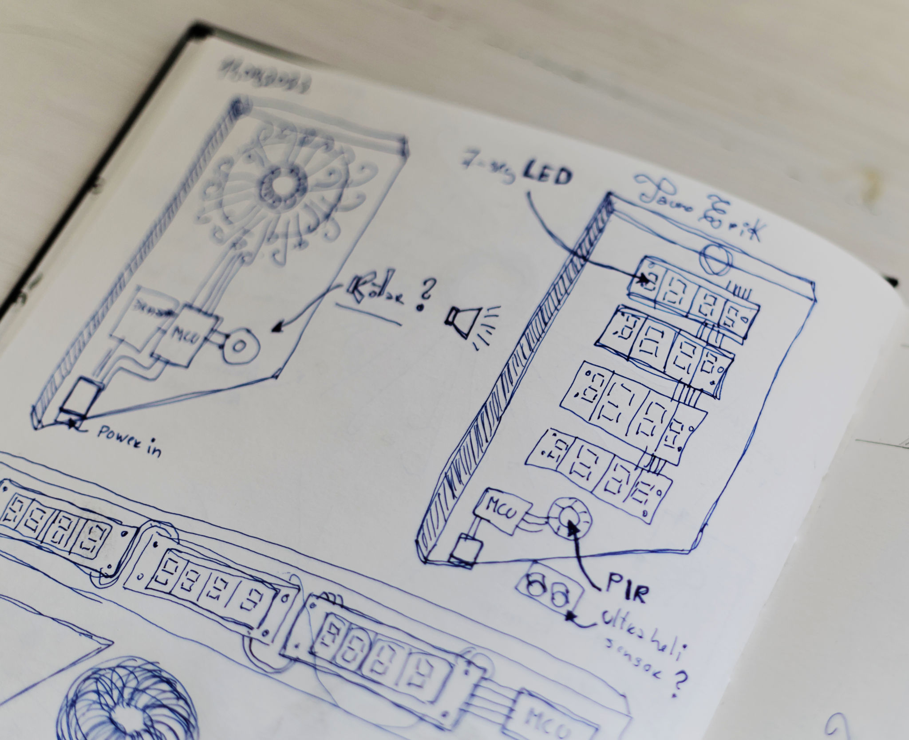
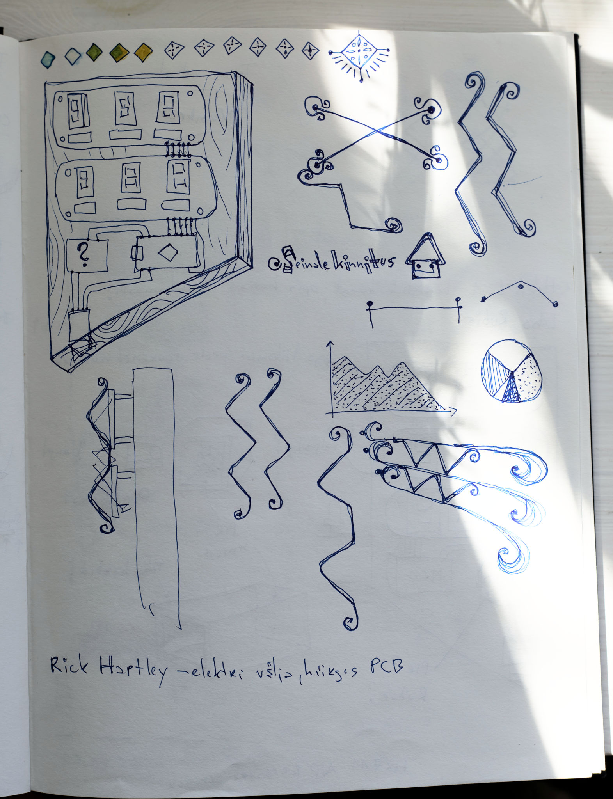
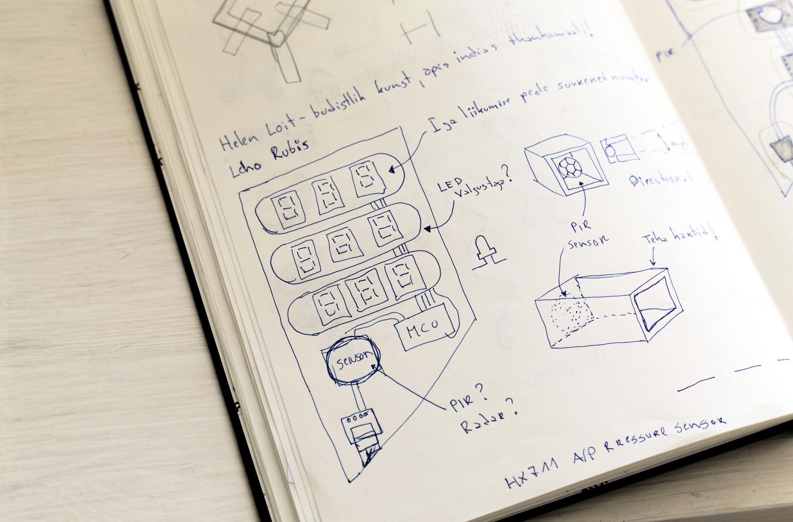
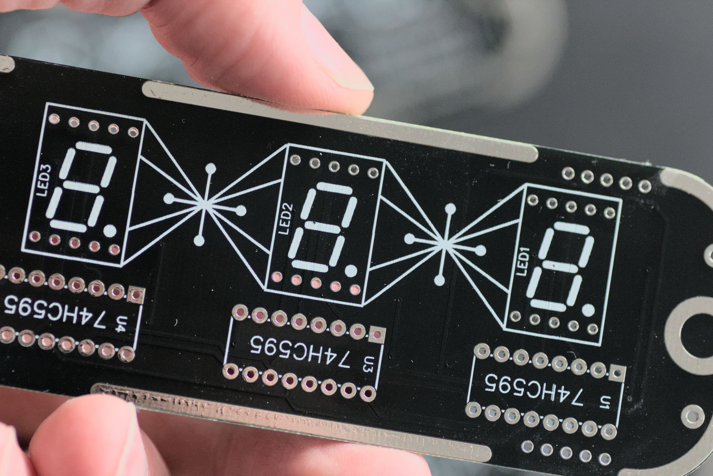
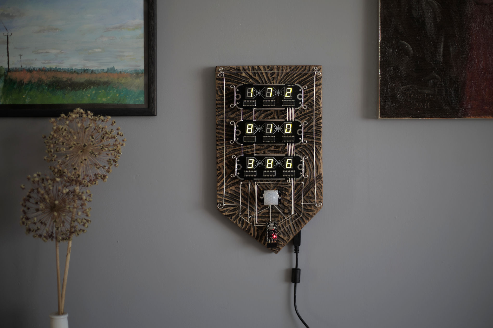

# Coat of arms of the accountant

I like history and I like medieval European coats of arms. Of course, nowadays, their design has its own rules and order. But when I have searched the early ones and found some. They can look wild. So I thought to make some mixed ones — medieval combined with electronics.

The hardware part is ready. In the software part, I need to still experiment with different ideas.

## Ideas

My first design ideas had a little bit of a different design. Especially on the bottom part.

## Hardware and electronics

The base is a solid oak panel. Hand carved and coated with antique beeswax. I use tinned copper wire TCW18. The MCU board is an Arduino Pro micro (not original). And I use the PIR HC-SR501 motion sensor.

For 7-segment LEDs, I designed a PCB board. Which can hold three of them. I ordered them from PCBWay. My PCB is a mix of through hole and SMD components. Because I already had the Shift registers and only needed to buy SMD resistors. Took some time to find affordable 7-segment LEDs with a green colour. Most of them are red and other colours are usually much more expensive.

## Links

- [Project page on GitHub](https://github.com/taunoe/numbr6)
- [Project page on My website](https://taunoerik.art/2022/05/22/coat-of-arms-of-the-accountant/)
- [Heraldry: What is a coat of arms and what was it for?](https://www.youtube.com/watch?v=zexpH6GCOh8) YouTube

___
Tauno Erik, 2022, [taunoerik.art/](https://taunoerik.art/) :estonia:, Слава Україні! Героям Слава! :ukraine:
